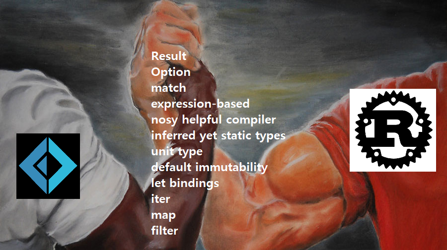
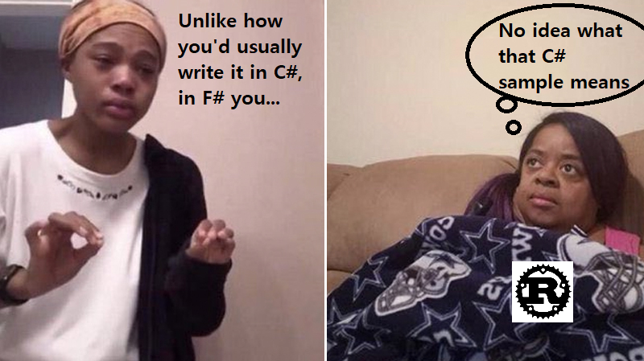

# Rust for Fsharpers and F# for Rustaceans



# What's this repository for?

Its intent is to be an informal manual for users of Rust and F# to read through to learn about the other language. Here's why I'm putting it together:

[Rust is my first language](https://github.com/Dhghomon/programming_at_40/blob/master/README.md), and recently I've begun delving into languages in the Rust periphery, one of which is F# (since the Rust compiler was originally written in OCaml and it incorporates a good deal of its syntax).

Almost every F# manual is written for C# developers in mind. ("In C# you do this, but in F# you do THIS") That's fine, but I have no real familiarity with C#. And when I look at F# in practice I see Rust everywhere: Options, Results, match statements, iterators, and so on and so forth, and as a Rustacean there's no need to convince me of their benefits. Reading a book on F# with references to C# everywhere for a Rustacean is kind of like a German being forced to learn Dutch through Portuguese. And for an Fsharper, reading a beginner's book on Rust that assumes the user doesn't know about Option, match statements and the rest is too much filler to be enjoyable to read.


     


With so much in common, an F# guide that's readable for Rustaceans that also serves as a Rust guide for F# users seems to be a necessity. So let's put one together.

I will be adding to this whenever an idea strikes me, but note that I am still very weak at F# and would appreciate comments or PRs for anything I get wrong or haven't explained sufficiently.

That's enough for an intro. Let's start!

# Trying out the language without installing

Both languages have nice online environments to practice without having to install anything. In Rust you use the [Rust Playground](https://play.rust-lang.org/), while F# uses a site called [Try F#](https://try.fsharp.org/).

# Expression-based languages

Almost everything is an expression in both languages, and the last expression in a code block becomes what is returned. Curly brackets are used to indicate a scope in Rust, while F# uses whitespace. Note the similarities between these two:

Rust:

```rust
fn main() {
    let x = {
        let x = 5;
        let y = 10;
        x + y // the last statement is the return value -
              // no return keyword needed!
    };
}
```

F#:

```
let x = 
    let x = 5
    let y = 10
    x + y
```

# Primitive types

Both Rust and F# have a compiler that uses type inference. They also both use `let` bindings. So if you write the following:

```rust
let x = 9;
```

It will make `x` an `i32` in Rust, which in F# is an `int`...which is also a 32 bit signed integer. By the way, F# doesn't use a semicolon at the end (so don't use one) but the compiler also won't yell at you if you do. There's no reason to add semicolons to the previous example but the effect is the same even if we do:

```
let x = 
    let x = 5;
    let y = 10;
    x + y
```

(This is because it returns a unit type in both cases.)

Let's look at some primitive types:

* Rust `u8` in F# is a `uint8` which is also a `byte` (.NET: `System.Byte`).
* Rust `u16` in F# is a `uint16` (.NET: `System.UInt16`)
* Rust `u32` in F# is a `uint32` (.NET: `System.UInt32`) which is also a `uint`.
* Rust `u64` in F# is a `uint64` (.NET: `System.UInt64`)
* Rust `i8` in F# is an `int8` which is also an `sbyte` (.NET: `System.SByte`).
* Rust `i16` in F# is an `int16` (.NET: `System.Int16`)
* Rust `i32` in F# is an `int32` (.NET: `System.Int32`) which is also an `int`.
* Rust `i64` in F# is an `int64` (.NET: `System.Int64`)
* Rust `usize` in F# is `unativeint` (.NET: `System.UIntPtr`)
* Rust `isize` in F# is `nativeint` (.NET: `System.IntPtr`)
* Rust `f32` in F# is `float32` which is also a `single` (.NET: `System.Single`).
* Rust `f64` in F# is `float` which is also a `double` (.NET: `System.Double`). Both Rust and F# default to this type of float when you give it a number with a decimal.

Both Rust and F# use postfixes on numbers to indicate the type if you want to choose something besides the default 32-bit int or 64-bit float. In Rust you can choose either declaring the type or adding a postfix, while in F# it's the postfix that does it. Thus:

* Rust `let x: u8 = 5` or `let x = 5u8` is F# `let x = 5uy`. (**u**nsigned b**y**te)
* Rust `let x: u16 = 5` or `let x = 5u16` is F# `let x = 5us`. (**u**nsigned **s**hort)
* Rust `let x: u32 = 5` or `let x = 5u32` is F# `let x = 5u`. (**u**nsigned)
* Rust `let x: u64 = 5` or `let x = 5u64` is F# `let x = 5UL`. (**U**nsigned **L**ong)
* Rust `let x: i8 = 5` or `let x = 5i8` is F# `let x = 5y`. (b**y**te)
* Rust `let x: i16 = 5` or `let x = 5i16` is F# `let x = 5s`. (**s**hort)
* Rust `let x: i32 = 5` or `let x = 5i32` is F# `let x = 5`. (no postfix here - it's the default)
* Rust `let x: i64 = 5` or `let x = 5i64` is F# `let x = 5L`. (**L**ong)
* Rust `let x: f32 = 5.0` or `let x = 5.0f32` is F# `let x = 5.0f` or `let x = 5f`.
* Rust `let x: f64 = 5.0` or `let x = 5.0f64` is F# `let x = 5.0`. (no postfix here - it's the default)

And both Rust and F# have the option of putting _ in between numbers to make them readable. This code works in both languages:

```
let num = 8000000;
let readableNum = 8_000_000;
let maybeReadableNum = 8___________000________000;
```

As for the F# `decimal` type (`Decimal` in .NET), Rust doesn't have one. Or rather, [it does](https://crates.io/crates/rust_decimal) but it's not part of the standard library. The Rust standard library is particularly small (doesn't even have a random number function for example) and decimals are another type for which external crates (crate = NuGet package, basically) are used. Adding an external crate to your Rust code is as simple as adding a single line to your `cargo.toml` file:

```
[dependencies]
rust_decimal = "1.14" <-- Add this and you're done
```

Then you hit `cargo run` (like `dotnet run`), and it will download the external package, compile and run your code.

(Apparently the F# equivalent to cargo.toml is paket.dependencies.)

* Rust `char` in F# is a `char` (.NET `Char`). Rust `char` is UTF-32 and is always four bytes, while in F# they are UTF-16.
* Rust `unit` in F# is also `unit`. They both use `()` to represent it. This is one of those types that is very welcome to see for a Rustacean. (Almost) everything is an expression!
* Rust `str` in F# is `string`. The F# documentation calls it "a sequential collection of characters that's used to represent text. A String object is a sequential collection of System.Char objects that represent a string".
* Rust `String` in F# is [`StringBuilder`](https://docs.microsoft.com/en-us/dotnet/api/system.text.stringbuilder?view=net-5.0). From the F# documentation: "Represents a mutable string of characters". It is used to effiecently build immutable 'string' objects.
It is very similar to String which is defined as:

```rust
pub struct String {
    vec: Vec<u8>,
}
```

(For F# readers: a `Vec` is probably closest to [ResizeArray](https://twitter.com/ReedCopsey/status/1399492773900914691))

So perhaps a Rust equivalent of the F# `string` would be:

```rust
pub struct String {
    vec: Vec<char>,
}
```

However, note that .NET strings [are immutable](https://docs.microsoft.com/en-us/dotnet/api/system.string?view=net-5.0#Immutability):

```
A String object is called immutable (read-only), because its value cannot be
modified after it has been created. Methods that appear to modify a String 
object actually return a new String object that contains the modification.

Because strings are immutable, string manipulation routines that perform 
repeatedadditions or deletions to what appears to be a single string can exact a
 significant performance penalty. For example, the following code uses a random 
number generator to create a string with 1000 characters in the range 0x0001 to 
0x052F. Although the code appears to use string concatenation to append a new 
character to the existing string named str, it actually creates a new String 
object for each concatenation operation.
```

So in that case it's very different from a `Vec<char>`, which can simply append a `char` and only needs to reallocate once it surpasses its capacity (which is done automatically).

## Casting to other types

In Rust you use `as` to cast one primitive type into another:

```rust
fn print_isize(number: isize) { // This will only take an isize
    println!("{}", number);
}

fn main() {
    let x: i8 = 9;
    print_isize(x as isize); // so we cast it into one with as
}
```

In F# you write the name of the type to cast into before the name of the 'variable'. Let's say we have a function that insists on taking a `byte` type:

```fs
let printByte (number: byte) =
    printfn "%i" number
```

(For Rust users: the `%i` means to print out something that is an integer. If you change it to `%s` (string) for example it will not compile)

Then if we have a number that we simply declare to be 9, F# will make it an `int` (an `i32` in Rust) and you will need to cast it as `byte`.

```fs
let printByte (number: byte) =
    printfn "%i" number

let number = 9
printByte (byte number)
```

Note the difference between the two: for F# we had to outright specify that the function will only take a `byte` for it not to compile; otherwise it will adapt the type of the function to the input it gets. Rust is stricter and requires generics to take in various types. (F# has generics too - more on the differences between the two in that section)

However, F# is not all loosey-goosey when it comes to function inputs. For example:

```fs
let printNumber number =
    printfn "%i" number

let number = 9
printNumber number
```

Here, the compiler will know from `%i` and the let binding on `number` that it's taking in an int, and the function signature will be `number:int -> unit`. But if you add the following:

```fs
let printNumber number =
    printfn "%i" number

let number = 9
printNumber number // Give an int
printNumber (byte number) // Then give a byte
```

This time it will refuse to compile, because it has determined that it needs an `int` and now we've told it to also take a `byte` type as well. The former input has set the variable input type in stone and it duly refuses:

```
This expression was expected to have type
    'byte'    
but here has type
    'int'   
```

On that note, let's compare compiler messages for the same issue. Let's make a function that takes an `int` in F# and `i32` in Rust, but receives a `byte` in F# (a `u8`) in Rust and see what it says.

F#:

```fs
let printNumber (number: int) =
    printfn "%i" number

let number = 9
printNumber (byte number)
```

Rust:

```rust
fn print_i32(number: i32) {
    println!("{}", number);
}

fn main() {
    let x: u8 = 9;
    print_i32(x);
}
```

The messages are:

F#

```
This expression was expected to have type
    'byte'    
but here has type
    'int'
```

Rust

```
7 |     print_i32(x);
  |               ^
  |               |
  |               expected `i32`, found `u8`
  |               help: you can convert a `u8` to an `i32`: `x.into()`
```

Notice that the messages are saying the same thing backwards.

Rust: expected `i32`, found `u8` = **The function is expecting an i32, but you gave me a u8**

F#: This expression was expected to have type 'byte' but here has type 'int' = **Your input made me expect a byte, but the function is of type int**

(The part mentioning `.into()` in the Rust message is another way to convert between types - more on that later)

In Rust, the `as` keyword is often used to rename types, enum variants etc. within a scope if you have duplicate names or the names are too long.

```rust
// Some weird enum from an external crate
enum ErrorTypes {
    BigErrorExplanationThatIsTooLongToType,
    WhyDidTheyWriteTheseEnumVariantsLikeThisSeriously,
    ButThisIsPartOfExternalCodeINeedToCompile,
}

// Let's shorten this
use ErrorTypes::{
    BigErrorExplanationThatIsTooLongToType as ErrorOne,
    ButThisIsPartOfExternalCodeINeedToCompile as ErrorTwo,
    WhyDidTheyWriteTheseEnumVariantsLikeThisSeriously as ErrorThree,
};

fn main() {

    let x = ErrorOne;

    match x {
        ErrorOne => {}
        ErrorTwo => {}
        ErrorThree => {}
    }
}
```

## The inline keyword in F#

(Thanks to [isaacabraham](https://github.com/Dhghomon/rust-fsharp/issues/1) for this)

If we would like the `printNumber` function to work for more than just one type, there is a way to make it generic: the `inline` keyword. Rust also has an `inline` keyword but it's an attribute [used for greater performance](https://nnethercote.github.io/perf-book/inlining.html) in certain cases.

One quick note, both languages use attributes in a similar form:

- Rust attribute: `#[attribute_name]` 
- F# attribute: `[<AttributeName>]`

So back to `inline`: in F# they are used for generics. Taking a look at the [documentation](https://docs.microsoft.com/en-us/dotnet/fsharp/language-reference/functions/inline-functions), this will look familiar:

```
Inline functions are functions that are integrated directly into the calling code.

Using Inline Functions
When you use static type parameters, any functions that are parameterized by type 
parameters must be inline. This guarantees that the compiler can resolve these type 
parameters. When you use ordinary generic type parameters, there is no such restriction.
     
The presence of inline affects type inference. This is because inline functions can 
have statically resolved type parameters, whereas non-inline functions cannot.
```
     
Ah! So it's similar to Rust's static dispatch / monomorphization (monomorphization = making it have a single form): namely, where you write code that tells the compiler to take a certain generic type, which is then statically dispatched during compile time into a concrete type. Let's look at Rust generics for a moment to see how this works.
     
```rust
use std::fmt::Display;

fn print_thing<T: Display>(input: T) {
    println!("{}", input);
}

fn main() {
    print_thing(8);
    print_thing('a');
    print_thing("Hiya there.");
}
```
     
[std::fmt::Display](https://doc.rust-lang.org/std/fmt/trait.Display.html) is a trait that lets you use `{}` to print a type, and is used for more human-readable displays. When implementing it yourself, you have to write the function to instruct how it will be displayed. (Debug on the other hand is easy to implement with just an attribute and gives an informative yet less pretty output)
     
So then we have `fn print_thing` that takes a generic type `T`, which we say to the compiler will have the `Display` trait. All of Rust's primitive types have Display. Now that we've told it that, the compiler is happy with us saying `println!` with `{}` because it knows a type with `Display` will be shown here. Then we use it on three types: an `i32`, a `char`, and a `&str`.
     
Then the program is compiled, and the static dispatch / monomorphization happens. The compiler puts together three functions with concrete types, and there's no evaluation happening at runtime. It ends up with something like this instead:

```rust
fn print_thing_i32(input: i32) {
    println!("{}", input);
}
     
fn print_thing_char(input: char) {
    println!("{}", input);
}
     
fn print_thing_str(input: &str) {
    println!("{}", input);
}
```
     
So it looks like the `inline` keyword is doing the same thing in F#. Before the `inline` keyword, we had this:

```fs
printNumber : number: int -> unit
     
let printNumber number =
    printfn "%i" number

let number = 9
printNumber number
printNumber (byte number)
```

Hovering over `printNumber` shows that it is: `printNumber : number: int -> unit`. But if we put the `inline` keyword in:
     
```fs
let inline printNumber number =
    printfn "%i" number

let number = 9
printNumber number
printNumber (byte number)
```
     
Now it changes to this:
     
```val printNumber : number:'a -> unit (requires 'a : (byte|int16|int32|int64|sbyte|uint16|uint32|uint64|nativeint|unativeint))```
     
So it looks like a generic function that will work for anything that requires the `+` operator on an int, and the inline keyword seems to have the compiler perform monomorphization to change `printNumber number` into a function that takes an `int16`, and for `printNumber (byte number)` into a function that takes a `byte`.

# Match

Both Rust and F# use the keyword `match`. Using `match` is pretty similar, but there are some differences. Here's the first one:

If you don't include all cases or use `_` to match all other remaining cases, Rust will fail to compiler. F# will compile, but it will give you a warning.

Rust:

```rust
enum Mood {
    Good,
    Okay,
    Bad
}

fn check_mood(mood: Mood) {
    match mood {
        Mood::Good => println!("Feeling good"),
        Mood::Bad => println!("Not so good")
    }
}
```

Rust will generate the following:

```
error[E0004]: non-exhaustive patterns: `Okay` not covered
```

In F# you might see something like this:

```fs
type Mood = | Good | Okay | Bad

let myMood = Good

let matchMood = match myMood with
    | Good -> printfn "Feeling good"
    | Bad -> printfn "Not so good"
```

It compiles, but the moment this is written you see the following below: `Incomplete pattern matches on this expression. For example, the value 'Okay' may indicate a case not covered by the pattern(s).`

Also note that syntax in F# will tend to vary depending on how you want the code to look. The following does the same:

```fs
type Mood =
    | Good 
    | Okay 
    | Bad

let myMood: Mood = Good

let matchMood = 
    match myMood with
        | Good -> printfn "Feeling good"
        | Bad -> printfn "Not so good"
```

Note that this time we specified the type: `let myMood: Mood = Good`. The F# compiler will also use type inference on the inside of a type to try to determine what it is; Rust will not do that. So if you write a second enum with all the same fields:

```fs
type Mood = | Good | Okay | Bad

type Mood2 = | Good | Okay | Bad

let myMood = Good

let matchMood = 
    match myMood with
        | Good -> printfn "Feeling good"
        | Bad -> printfn "Not so good"
```

It will make `myMood` of type `Mood2` (it is basically shadowing `Mood`). Watch out! And this happens even if a single field is the same and/or in a different order:

```fs
type Mood = | Good | Okay | Bad

type Mood2 = | Bad | Good

let myMood = Good

let matchMood = 
    match myMood with
        | Good -> printfn "Feeling good"
        | Bad -> printfn "Not so good"
```

Here as well `myMood` is a `Mood2`. Rustaceans will be in the habit of writing `let myMood: Mood` in any case, but keep in mind that the F# compiler will not do your work for you if you give multiple types the same field names and don't declare their types when making a let binding.

Interestingly, F# also has a `function` keyword that is basically short for `match (name) with`.

```fs
type Options = 
    | Sunny
    | Rainy
    | Other

let message = function
    | Sunny -> printfn "It's sunny today"
    | Rainy -> printfn "It's rainy"
    | Other -> printfn "Not sure what the weather is."

message Sunny
```

This will print out "It's sunny today".

Over on the [F# documentation](https://docs.microsoft.com/en-us/dotnet/fsharp/language-reference/match-expressions) you can see an example of both:

```fs
// Pattern matching with multiple alternatives on the same line.
let filter123 x =
    match x with
    | 1 | 2 | 3 -> printfn "Found 1, 2, or 3!"
    | a -> printfn "%d" a

// The same function written with the pattern matching
// function syntax.
let filterNumbers =
    function | 1 | 2 | 3 -> printfn "Found 1, 2, or 3!"
             | a -> printfn "%d" a
```


# Currying

Currying doesn't exist in Rust, while F# uses it all the time. Currying means to have a function that takes multiple parameters, but is fine with just taking in one or a few instead of all of them at the same time. For Rustaceans, it would be sort of like this...

```rust
fn add_three(num_one: i32, num_two: i32, num_three: i32) {
    num_one + num_two + num_three
}
```

except that the return type is not `i32`, it's whatever's left to make the function work. Give it a single `i32` (let's say we type `add_three(8)`) and now it will know the value of `num_one`, and then pass you back this:

```rust
fn two_left(num_two: i32, num_three: i32) {
    let num_one = 8;
    num_one + num_two + num_three
}
```

(two_left is just a sample name to show what it takes in now)

Now if you type `two_left(9, 10)` it will complete the function with output `i32` and pass back the final number: 27. But if you just give it `two_left(9)`, it will give you:

```rust
fn one_left(num_three: i32) -> i32 {
    let num_one = 8;
    let num_two = 9;
    num_one + num_two + num_three
}
```

In F# it looks like this:

```fs
let addThree a b c = a + b + c

let twoLeft = addThree 8
let oneLeft = twoLeft 9
printfn "%i" (oneLeft 10)
```

Interesting fact: all functions in F# are curried, which is why they have this interesting signature:

```fs
val addThree : a:int -> b:int -> c:int -> int
```

When you pass in three numbers to the function, it will curry the function with one input parameter at a time, passing it on until all three have a value and then finally return an `int`. (I may have explained this oddly or wrongly - let me know if so)

In Rust, the function would look like this:

```rust
fn add_three(a: i32, b: i32, c: i32) -> i32
```

Note that the spaces between inputs isn't just F# trying to be cool and minimalistic: it's the currying syntax. If you don't want a function to be curried, put the inputs inside of a tuple:

```fs
let addThree (a, b, c) = a + b + c

printfn "%i" (addThree (8, 9, 10))
```

Fsharpers don't usually like to enclose things in brackets though (especially double brackets) and prefer to use the pipeline operator. This sort of thing might be preferable:

```fs
let addThree (a, b, c) = a + b + c

let finalNumber = (8, 9, 10) |> addThree

printfn "%i" finalNumber
```

So let's talk about the pipeline operator now. Rust has something similar too.

# Pipelining

Rust doesn't use the word pipeline, nor does it have the `|>` operator. However, sometimes you'll see syntax that reminds you of one in the other. First, let's talk about what the pipeline operator does.

Because (almost) everything is an expression in F# too, pretty much everything you get will return something, even a `()` type. With `|>` you can quickly pass the return on to something else. Here's an example:

```fs
let addOne x = x + 1
let timesTwo x = x * 2
let printIt x = printfn "%A" x

8 |> addOne |> timesTwo |> printIt
```

So here you see three functions, each of which does something: one adds 1, the next multiplies by two, and the last one prints it.

By the way: `%A` prints tuples, record and union types. This is most similar to the `Debug` trait in Rust, which uses `{:?}` (for Debug printing) instead of `{}` (Display printing). Using `%A` is a quick way to avoid having to specify `%i` (int), `%s` (string) etc. when printing. Another specifier is %O to print other objects (this automatically uses ToString() to do it).

The same in Rust (well, almost the same) would look like this:

```rust
fn add_one(x: i32) -> i32 {
    x + 1
}

fn times_two(x: i32) -> i32 {
    x * 2
}

fn print_it<T: std::fmt::Debug>(x: T) {
    println!("{:?}", x)
}

fn main() {
    print_it(times_two(add_one(8)));
}
```

Here we're putting them inside successive parentheses to accomplish the same thing. The `T: std::fmt::Debug` is generic and is saying "I guarantee to give you something that can be Debug printed" to the compiler.

If you wanted a more left to right syntax like in F#, you would want to create structs with methods that can do this and it probably wouldn't be worth it. However, you do see this sort of syntax a lot with iterators, which are made to be passed on from left to right. Working with iterators is probably where Rust's syntax gets most 'pipeliney'. For example, let's take ten numbers from 0 to 10, multiply each by two, keep only the even numbers, and then collect it into a `Vec`. It looks like this:

```rust
fn main() {
    let times_two_then_even: Vec<i32> = (0..=10)
        .map(|number| number * 2)
        .filter(|number| number % 2 == 0)
        .collect();

    println!("{:?}", times_two_then_even);
}
```

Printing that gives us `[0, 2, 4, 6, 8, 10, 12, 14, 16, 18, 20]`.

The F# version is very similar:


```fs
let timesTwoThenEven =
    [0..10]
    |> List.map (fun number -> number * 2)
    |> List.filter (fun number -> number % 2 = 0)

printfn "%A" timesTwoThenEven
```

Here's the output: `[0; 2; 4; 6; 8; 10; 12; 14; 16; 18; 20]`

Notice the difference between the two: both use closures/anonymous functions to perform the work, but the signature is:

Rust: |variable_name_here| variable_name_here * 2

F#: (fun variable_name_here -> variable_name_here * 2)

In Rust, `||` is for closures and `()` for regular functions, while in F# regular functions don't have a particular syntax and closures have `fun` in front of them.

In both cases you are giving a name to the input in order to tell it what to do in the next stage.
     
(By the way, both Rust and F# share the distinction between closures (anonymous functions that capture variables) and anonymous functions (just functions without names) but Rustaceans will tend to call anything with the `||` pipes a closure even if it's technicaly an anonymous function. Even the [Book](https://doc.rust-lang.org/book/ch13-01-closures.html) describes them as "anonymous functions that **can** capture their environment, not anonymous functions that **do** capture their environment. For a discussion on the nomenclature, see [this issue](https://github.com/Dhghomon/easy_rust/issues/44))

There is a big difference between Rust and F# here: Rust has something known as "zero-cost abstractions", which essentially means that there is no performance impact for fancy code compared to simple `for` loops and such things. Let's look at `times_two_then_even` in Rust again:

```rust
    let times_two_then_even: Vec<i32> = (0..=10)
        .map(|number| number * 2)
        .filter(|number| number % 2 == 0)
        .collect();
```

This gives a `Vec<i32>` because of the `.collect()` method at the end. Let's see what happens when we take it out and don't assign it to a variable:

```rust
fn main() {
    (0..=10)
        .map(|number| number * 2)
        .filter(|number| number % 2 == 0);
}
```

It compiles, but tells us that we actually haven't done anything:

```
warning: unused `Filter` that must be used
 --> src/main.rs:2:5
  |
2 | /     (0..=10)
3 | |         .map(|number| number * 2)
4 | |         .filter(|number| number % 2 == 0);
  | |__________________________________________^
  |
  = note: `#[warn(unused_must_use)]` on by default
  = note: iterators are lazy and do nothing unless consumed
```

This is because calling these iterator methods without collecting them or assigning them to a variable just makes a big complex type; we haven't mapped or filtered anything yet. Let's see what it looks like by getting the compiler mad:

```rust
fn main() {
    let times_two_then_even: i32 = (0..=10) // Tell the compiler it's an i32
        .map(|number| number * 2)
        .filter(|number| number % 2 == 0);
}
```

The compiler complains:

```
expected type `i32`
     found struct `Filter<Map<RangeInclusive<{integer}>, 
     [closure@src/main.rs:3:14: 3:33]>, [closure@src/main.rs:4:17: 4:41]>`
     
```

So all we've done is put together a type Filter<Map<RangeInclusive etc. etc. etc. And if we call .map a whole bunch of times it just keeps on putting this big struct together:

```
found struct `Map<Map<Map<Map<Map<Map<Map<Map<RangeInclusive<{integer}>, [closur
e@src/main.rs:3:14: 3:33]>, [closure@src/main.rs:4:14: 4:33]>, [closure@src/main
.rs:5:14: 5:33]>, [closure@src/main.rs:6:14: 6:33]>, [closure@src/main.rs:7:14: 
7:33]>, [closure@src/main.rs:8:14: 8:33]>, [closure@src/main.rs:9:14: 9:33]>, [c
losure@src/main.rs:10:14: 10:33]>`
```

This struct is all ready to go, and gets run *once* when we actually decide to do something with it (like collect it into a `Vec`). The pipeline operator in F#, however, gets run every time you use it: if you do something like this:

```fs
let addOne x = x + 1;

let number  = 
    addOne 9
    |> addOne
    |> addOne
    |> addOne
    |> addOne
    |> addOne
    |> addOne
```

It's going to call `addOne` every time, and same for F#'s iterator methods. Apparently too much usage of the pipeline operator can slow down performance, though F# is performant enough. (Somewhat less that C#, miles faster than something like Python) Rust is naturally right up there with C and C++ in terms of performance.

F# also has something called the "forward composition operator" which looks like `>>`, which is a fancy way of saying that it smushes functions together into one. It's basically the same as a pipeline except all the operations are turned into a single function. Here's a simple example:

```fs
let addOne x = x + 1
let timesTwo x = x * 2
let printOut x = printfn "%i" x

let addMultiplyPrint = addOne >> timesTwo >> printOut

addMultiplyPrint 9
```

That prints out `20`. You can imagine it being useful from time to time, though the pipeline operator alone is clear enough and makes it easy to make small changes (like if you wanted to change `let addOne x = x + 1` to `let addNum x y = x + y`).

F# also has a right to left pipeline operator: `<|`. Users of F# caution against using it too much, and say it should only be used sparingly when it makes code readable. Using both results in some pretty wacky syntax:

```fs
let printTwo x y = printfn "%i and %i" x y

8 |> printTwo <| 9
```

The compiler is perfectly happy with this, printing out `8 and 9`. But there's no reason to write it this way over the simpler `printTwo 8 9`.

Although even that syntax could be interesting once in a while. Here's one example:

```fs
type Diplomat = {
    name: string
    message: string
}

let diplomat1 = {name = "Quintus Aurelius"; message = "We demand concessions!"}
let diplomat2 = {name = "Argentyx"; message = "We would rather die!"}

let meeting person1 person2 =
    printfn "%s says: %s" person1.name person1.message
    printfn "%s responds: %s" person2.name person2.message

diplomat1 |> meeting <| diplomat2
```

Kind of looks nice to see our two diplomats approaching each other in the middle with `diplomat1 |> meeting <| diplomat2` rather than a boring old `meeting diplomat1 diplomat2`. The output is of course:

```
Quintus Aurelius says: We demand concessions!
Argentyx responds: We would rather die!
```

On that note, what is that `type Diplomat` doing there? Let's look at that now.

# Rust structs, F# record types and structs

The main custom data type in Rust is a struct, which looks very similar to the type we just declared above. Let's look at a Rust `Diplomat` struct and the F# `Diplomat` record again:

```rust
struct Diplomat {
    name: String,
    message: String
}
```

```fs
type Diplomat = { 
    name: string
    message: string 
    }
```

Note that the fields in Rust are separated with commas, and a new line in F#. In F# you can also use semicolons if you want the fields on the same line:

```fs
type Diplomat = { name: string; message: string }
```

Rust users will also have noticed that we didn't even say we were creating a `Diplomat` when we instantiated them. All we wrote was this:

```fs
let diplomat1 = {name = "Quintus Aurelius"; message = "We demand concessions!"}
```

This is once again an example of the F# compiler looking at the fields of a type to infer the type. The inference doesn't go *that* deep though. For example, if we make a separate Diplomat2 type:

```fs
type Diplomat = { name: string; message: string }
type Diplomat2 = { name: string; message: string }
```

Then the `meeting` function will assume that it's taking a `Diplomat2` because it shadows the previous one:

```fs
let meeting person1 person2 =
    printfn "%s says: %s" person1.name person1.message
    printfn "%s responds: %s" person2.name person2.message
```

But even declaring this type will cause it to err!

```fs
type Diplomat = { name: string; message: string }
type MessagelessDiplomat = { name: string }
```

Here too the compiler assumes that the function will take a `MessagelessDiplomat`, and because it doesn't have a `message` field it will give an error. A Rustacean in any case will certainly feel more comfortable declaring function with this sort of syntax:

```fs
let meeting (person1: Diplomat) (person2: Diplomat) =
    printfn "%s says: %s" person1.name person1.message
    printfn "%s responds: %s" person2.name person2.message
```

You can also declare anonymous record types in F# by adding `||`:

```fs
let diplomat1 = {|
    name = "Marcus Aurelius"
    message = "The Emperor demands tribute."
    |}

printfn "%s says: %s" diplomat1.name diplomat1.message
```

If you want to add methods to a record, you use the `member`keyword, followed by `this` and the method you want to write.

```fs
type Diplomat = 
    {
        name: string
        message: string
    }
    member this.Talk = 
        printfn "%s says: %s" this.name this.message

```

Now our diplomatic summit turns into this:

```fs
type Diplomat = 
    {
        name: string
        message: string
    }
    member this.Talk = 
        printfn "%s says: %s" this.name this.message


let meeting (person1: Diplomat) (person2: Diplomat) =
    person1.Talk
    person2.Talk

let diplomat1 = {name = "Quintus Aurelius"; message = "We demand concessions!"}
let diplomat2 = {name = "Argentyx"; message = "We would rather die!"}

diplomat1 |> meeting <| diplomat2
```


Now let's look at Rust structs in comparison. Let's look at the Diplomat struct again:

```rust
struct Diplomat {
    name: String,
    message: String
}
```

To declare one, you need to specify that you are creating a `Diplomat` - the Rust compiler doesn't root through the fields to try to determine the type for you. Also don't forget the semicolon. If you do this it won't work:

```rust
struct Diplomat {
    name: String,
    message: String
}

fn main() {
    let diplomat1 = Diplomat{
    name: "Quintus Aurelius".to_string(), message: "We demand concessions!".to_string()
        
    }
}
```

Fortunately, the Rust compiler generally knows what you are trying to do. Here's the message:

```
error: expected `;`, found `}`
  --> src/main.rs:10:6
   |
10 |     }
   |      ^ help: add `;` here
11 | }
   | - unexpected token
```

That was nice of it. Also note that the formatting above is a bit lazy. Let's type `cargo fmt` (or hit the Rustfmt button on the Playground) to make it nice.

```rust
struct Diplomat {
    name: String,
    message: String,
}

fn main() {
    let diplomat1 = Diplomat {
        name: "Quintus Aurelius".to_string(),
        message: "We demand concessions!".to_string(),
    };
}
```

Much better! One note here: the semicolon is necessary because Rust is an expression-based language too. Rust also treats the final line of an expression as the return value, but we are not looking to pass on a `Diplomat` to something else so we need a semicolon at the end to make it return a unit type instead.

The F# user is now going to be wondering what this `.to_string()` method is doing and why we need it in Rust. This is because Rust has more than one `String` type, and this is the simplest one to understand in a struct: it's similar to the F# string type mentioned above in that it is an owned collection, though in this case it's a collection of `u8` bytes. (We saw the signature above already) Without the `.to_string()` method, we are instead dealing with a "&str", which is a borrowed reference - the type does not own it. It is essentially an immutable view into a string. And because it doesn't own it, the compiler will complain at this sort of signature:

```rust
struct Diplomat {
    name: &str,
    message: &str,
}

fn main() {
    let diplomat1 = Diplomat {
        name: "Quintus Aurelius",
        message: "We demand concessions!",
    };
}
```

Because here `Diplomat` doesn't own the data, there's a possibility that you might pass in data that starts out owned by another object, which later on is dropped and deallocated, and now you have a reference to data that doesn't exist. The compiler will tell you to give it a hint about how long the data will live:

```
error[E0106]: missing lifetime specifier
 --> src/main.rs:2:11
  |
2 |     name: &str,
  |           ^ expected named lifetime parameter
  |
help: consider introducing a named lifetime parameter
  |
1 | struct Diplomat<'a> {
2 |     name: &'a str,
  |
```
 
As it turns out, the hint it gives you is exactly what you need to get the code to compile. It says "there is a lifetime that we'll call <'a> that the Diplomat struct lives for, and I'll only pass in a &str that lives for at least that long."

One note here for users of both languages: both languages use <> angle brackets to specify generics, but slightly differently:

`<'a>`: in Rust, this is a lifetime specifier: "this object will live for at least the lifetime that we'll call 'a." 

`<'a>`: in F#, this is a generic specifier.

`<T>`: in Rust, this is a generic specifier.

In short, stick with `String` in the beginning with Rust until you get used to lifetimes. A `&str` is more performant than a `String`, but is less flexible.

So back to the struct. How does Rust add methods? It uses what is known as an `impl` block. These are separate from the struct declaration, and you can use as many of them as you like. Inside the `impl` block you add your methods. You have four choices with methods:

- Methods that take `Self` (the equivalent of F# `this`): these take ownership of the struct's data! The struct will then only live until the end of the function. These methods are usually used with the builder pattern, by bringing in the object, making one change and then returning `Self` back to the struct. This is a bit F-sharpy since it allows you to chain one method to another. Let's take a look at this in detail. Here's a regular struct called `City`:

```rust
struct City {
    name: String,
    population: i32
}
```

Now we'll give it some methods. Start an `impl` block: 

```rust
impl City {

}
```

Then add some methods. First a new method. Note: `new` isn't a keyword in Rust - we could call this `neu` or `nouveau` or anything else.

```rust
fn new() -> Self { // Can also write City
    Self {
        name: "".to_string(),
        population: 0
    }
}
```

Because this method doesn't take `self` (or `&self` or `&mut self`), it's called an associated method and is called like this: `City::new()`. That's because there is no instance of `City` to use the dot operator on.

So that will make a new city with no name and a population of 0. Now let's add two methods that take self and return it after making a change:

```rust
fn population(mut self, population: i32) -> Self {
    self.population = population;
    self
}

fn name(mut self, name: &str) -> Self {
    self.name = name.to_string();
    self
}
```

(Note: no problem taking a `&str` here because we don't care about using it after the function is over. Nobody cares about the lifetime in this case, and it is turned into a `String` which is owned by the struct)

And with all that, we can now set up a city using this F#-like pattern:

```rust
fn main() {
    let city = City::new().population(100).name("My city");
}
```

Usually a `new` method will look more like this though:

```rust
fn new(population: i32, name: &str) -> Self {
    Self {
        population,
        name: name.to_string()
    }
}
```

Why didn't we write `population: population`? We could have, but if the two names are the same, we can just write `population`.

Now that the Fsharpiest part is out of the way, here is what is more commonly passed into methods: `&self` and `&mut self`. `&self` is a reference to self (you can read but not modify it) while `&mut self` is a mutable reference to self (you can modify it). As you can imagine, there are rules regarding references to avoid unexpected behaviour.

1) You can have as many references as you like if they are not mutable references.
2) You can have up to one mutable reference.
3) If you have a mutable reference, everything else is essentially frozen: nobody else can have a mutable or immutable reference as long as the mutable reference is still around.

Here is a quick example of code that doesn't compile:

```rust
fn main() {
    let mut my_string = "I am a string".to_string();
    let x = &my_string;
    let y = &mut my_string;
    
    println!("{}", x);
}
```

Once you declare x as a reference to `my_string`, it is expecting a `String` that says "I am a string". However, in the next line comes `y` which is able to modify the data that `x` has a reference to, and is going to try to print out two lines later. This is not okay, and the compiler tells us as much:

```
error[E0502]: cannot borrow `my_string` as mutable because it is also borrowed as immutable
 --> src/main.rs:4:13
  |
3 |     let x = &my_string;
  |             ---------- immutable borrow occurs here
4 |     let y = &mut my_string;
  |             ^^^^^^^^^^^^^^ mutable borrow occurs here
5 |     
6 |     println!("{}", x);
  |                    - immutable borrow later used here
```

Note the part that says "immutable borrow later used here", because the compiler is smart enough to track not just the creation of references, but whether they are being used or not. If we were to comment out line 6 it would compile, because even though we created references that both live until the end of the scope, the compiler can see that they never get used and it will not make an issue out of it. (Some years back the compiler wasn't capable of this and would always generate errors on the *existence* of such references instead of being able to track their actual use)

# Mutability

Both Rust and F# use let bindings for variables that are immutable by default. To make something mutable in Rust, add the `mut` keyword. F# requires a longer keyword: `mutable`. This fits with the F# philosophy of trying to avoid mutability as much as possible. In Rust immutability is just a common sense default - why make something mutable unless you need to change it?

Changing a mutable variable in Rust involves just `=` and the new value. Note that we're not using the `let` keyword here! Using `let` again would create a new variable that shadows the previous one. Using `=` naturally does not let you change the type of whatever it is we are modifying.

```rust
let mut x = 7;
x = 8;
```

In F#, changing the value of a mutable variable is done with the `<-` operator.

```fs
let mutable x = 7
x <- 8
```

# Order of code

In Rust, the order in which you write your code matters inside a single scope, while code outside of this does not. So a typical simple program will have something like this:

```rust
struct SomeStruct {
    field: i32
}

enum SomeChoices {
    Good,
    Bad
}

fn do_thing() {
    // Do a thing
}

fn main() {
    // Do stuff
}
```

But you can just as easily put the struct, enum and function below `main` and it would have no effect. The one exception to this is macro definitions. (Macros are function-like things that expand into source code before the compiler starts its work and are written with a `!` - more on them later) So this will work:

```rust
macro_rules! my_macro {
    () => {
        println!("You didn't give me anything");
    };
    ($a:expr) => {
    {
        println!("Here's your expression back");
        $a
    }
    };
}

fn main() {
    let x = my_macro!();
    let z = my_macro!(9);
}
```

But it won't recognize this `my_macro()!` macro if you move it down below main.

As for F#, order always matters. So if you have a `Customer` record like the one following:

```fs
type Customer = {
    name: string
    accountBalance: float
}

let billy = {
    name = "Billy Brown"
    accountBalance = 100.00
}
```

It will generate an error if you move it down below our `let billy` declaration. And not only this: the order of files in an F# program matters too! If you have multiple files, be sure to order them accordingly. This is in accordance with the F# "data in data out" sort of principle that likes to see everything done in order.

Besides named structs, Rust also has tuple structs. They are generally used for two things:

- Simple structs that don't need named fields.

```rust
struct RGB(u8, u8, u8);

fn main() {
    let my_colour = RGB(80, 65, 0);
}
```

- New types. While type aliases can be declared with the `type` keyword:

```fs
type VecOfInts = Vec<i32>;

fn main() {
    let some_vec: VecOfInts = vec![8, 9, 10];
}
```
     
this type is 100% equivalent to `Vec<i32>` and the compiler reads it as such. But a struct containing another type works as a new type, and while it does have access to the type's methods by calling on it (using `.0`), it is effectively a new type and that lets you implement other traits on it.
     
So this will no longer work:

```rust
struct VecOfInts(Vec<i32>);

fn main() {
    let some_vec: VecOfInts = vec![8, 9, 10];
}
```
     
But this will:
     
```rust
struct VecOfInts(Vec<i32>);

fn main() {
    let some_vec = VecOfInts(vec![8, 9, 10]);
}
```

And since `VecOfInts` is its own type, this won't work yet:
     
```rust
println!("{:?}", some_vec);
```
     
But this will:

```rust
println!("{:?}", some_vec.0);
```
     
The ears of Fsharpers will have perked up at this already, because F# uses these sorts of new types **a lot** and loves declaring them on the fly for type safety and readability. Here's an example:

```fs
type Temperature = 
    | Celsius of float
    | Fahrenheit of float
    | Kelvin of float
    | Réaumur of float

let getTemperature temperature = 
    match temperature with
        | Celsius number -> printfn "%.1f Celsius" number
        | Fahrenheit number -> printfn "%.1f Fahrenheit" number
        | Kelvin number -> printfn "%.1f Kelvin" number
        | Réaumur number -> printfn "%.1f Réaumur" number

getTemperature (Réaumur 9.0)

let temperature = Réaumur 9.0
```

You can see that `Temperature` does work like an enum, because you can match against it. The variants of `Temperature` also can contain values, though they are somewhat different than in Rust. Here is how you would do more or less the same thing:

```rust
enum Temperature {
    Celsius(f64),
    Fahrenheit(f64),
    Kelvin(f64),
    Reaumur(f64)
}

impl Temperature {
    fn get_temperature(&self) {
    use Temperature::*;
        match self {
            Celsius(number) => println!("{} Celsius", number),
            Fahrenheit(number) => println!("{} Fahrenheit", number),
            Kelvin(number) => println!("{} Kelvin", number),
            Reaumur(number) => println!("{} Réaumur", number),
        }
    }
}

fn main() {
    let temperature = Temperature::Reaumur(9.0);
    temperature.get_temperature();
}
```
     
So let's compare the two a little. First the Temperature type/enum:

```fs
type Temperature = 
    | Celsius of float
    | Fahrenheit of float
    | Kelvin of float
    | Réaumur of float
     
enum Temperature {
    Celsius(f64),
    Fahrenheit(f64),
    Kelvin(f64),
    Reaumur(f64)
}
```
     
The Rust version creates an enum called `Temperature` with four arms that all contain `f64`s. The F# version does something similar. However, in F# these are new types (like Rust tuple structs) organized together under a type called `Temperature`, whereas in Rust they are dependent arms of the enum. You can't write `let x = Reaumur(9.0);` in Rust, only `let x = Temperature::Reaumur(9.0);`.
     
The match statement is pretty much identical, though in F# it's an independent function compared with Rust which has it as a method. In both cases you could do the opposite (writing a method in F# or an independent function in Rust) but methods are generally preferred in Rust (because they are [convenient when it comes to working with references](https://doc.rust-lang.org/nomicon/dot-operator.html) for one) while I get the impression that F# likes freely roaming functions instead of methods attached to types.

```fs
let getTemperature temperature = 
    match temperature with
        | Celsius number -> printfn "%.1f Celsius" number
        | Fahrenheit number -> printfn "%.1f Fahrenheit" number
        | Kelvin number -> printfn "%.1f Kelvin" number
        | Réaumur number -> printfn "%.1f Réaumur" number
```
```rust
impl Temperature {
    fn get_temperature(&self) {
        use Temperature::*;
        match self {
            Celsius(number) => println!("{} Celsius", number),
            Fahrenheit(number) => println!("{} Fahrenheit", number),
            Kelvin(number) => println!("{} Kelvin", number),
            Reaumur(number) => println!("{} Réaumur", number),
        }
    }
}
```
     
Note that: 

- `get_temperature` is taking a reference to `self` because we only want to read the data, not destroy it. 
- We have `use Temperature::*;` to import all the arms of the enum (same as F# `open`) to avoid typing `Temperature::Celsius(number), Temperature::Fahreinheit(number)` etc. You don't have to do this but it saves keystrokes.
- The identifier Réaumur here is written Reaumur. Rust is working on [non-ASCII identifiers](https://doc.rust-lang.org/stable/unstable-book/language-features/non-ascii-idents.html) and this is already available as an unstable feature. It'll probably end up as a stable feature sooner rather than later.
     
# Collection types

Here is a quick overview of the collection types in both languages:

**MAIN TYPES**

Rust: Vec, array, tuples

F#: list, array, sequence, tuples

## Vec
     
As mentioned above, a `string` in .NET is `a sequence of Unicode characters`, and a Vec in Rust is sort of like this for whatever type happens to be inside it. `Vec<char>`, `Vec<i32>`, `Vec<Vec<i32>>`, etc. And a `String` in Rust is really a [Vec<u8>](https://doc.rust-lang.org/src/alloc/string.rs.html#279-281) (not chars). That's why F# code like this will be familiar to Rustaceans:
     
```fs
let printChar (str : string) (index : int) =
    printfn "First character: %c" (str.Chars(index))
```  

This prints the first character of a string after breaking the string into a sequence of `char`s. In Rust, you'd see something similar like this:

```
fn print_char(input: &str, index: usize) {
    let input = input.to_string();
    println!("First character: {}", input.chars().nth(index).unwrap_or(' '));
}

fn main() {
    print_char("Hey there", 8);
}
```
     
(The `unwrap_or()` method here is saying to either take the value from `Some` if it returns `Some` at that index, and otherwise to return a default value. A simple `.unwrap()` would panic if the index returned `None`)
     
On to actual `Vec`s: they are created with `Vec::new()` (empty Vec) or `Vec::from()` (if you have something that can be converted to a Vec, like an array), or most simply with the `vec![]` macro. This on its own won't compile if you don't specify the type:

```rust
fn main() {
    let mut x = vec![];
}
```

But the moment you push something into the `Vec` it will know the type. So this will work:
 
```
fn main() {
    let mut x = vec![];
    x.push(9);
}
```

To see all the methods for `Vec`, go to the documentation [here](https://doc.rust-lang.org/std/vec/struct.Vec.html) and look on the left.
     
Some of the most common are:
     
`push`: as seen above, this pushes a single item onto the Vec.

`with_capacity`: every Vec has an automatically determined capacity that starts at 0, then goes to 4 and thereafter doubles whenever necessary. You can see this in action in the following code, which tracks the capacity of the `Vec` and prints whenever it doubles:
     
```
fn main() {
    let mut new_vec = vec![];
    let mut current_capacity = new_vec.capacity();
    for _ in 0..100_000 {
        new_vec.push('a');
        if new_vec.capacity() != current_capacity {
            println!("Capacity is now {}", new_vec.capacity());
            current_capacity = new_vec.capacity();
        }
    }
}
```
     
Look at all the reallocations! You won't notice any performance impact at this level, but there's no reason to reallocate if you don't need to:
     
```
Capacity is now 4
Capacity is now 8
Capacity is now 16
Capacity is now 32
Capacity is now 64
Capacity is now 128
Capacity is now 256
Capacity is now 512
Capacity is now 1024
Capacity is now 2048
Capacity is now 4096
Capacity is now 8192
Capacity is now 16384
Capacity is now 32768
Capacity is now 65536
Capacity is now 131072
```
     
So just change `let mut new_vec = vec![];` into `let mut new_vec = Vec::with_capacity(100_000);` and you'll get a Vec that won't ever need to reallocate.
     
(By the way, if you push another 'a' into the Vec after this it will now have a capacity of 200000.)

`pop` - returns an `Option<T>` (T being whatever type the Vec is holding). Unwrap it if you are sure, otherwise do a match statement or `unwrap_or()` or similar method to safely handle it.

`chunks` - Splits your Vec into chunks. If you have a Vec of 25 items and call chunks(6) on it, it will give you four chunks of 6, followed by a final chunk of 1.

`windows` - Similar to chunks but only moves down one index at a time. If you have a Vec of 25 items and call windows(6) on it, it will give you one from index 0 to 6, then another from index 1 to 7, then index 2 to 8, and so on.

`contains` - returns a `bool` letting you know if it contains something.

`first` and `last` - returns the first or last item as an `Option<&T>` (because it might be empty). &T means a reference to the item: we're not popping it out.

`sort` - automatically sorts the Vec. Use `sort_by` if you want to specify your own sort.
     
So that's the most often used collection type in Rust. Let's look at the one F# uses the most: a list.
     
## List (F#)
     
A list is really quite different from similar types in Rust, because Rust for the most part eschews linked lists, and this is what a list is. Rust has a [LinkedList](https://doc.rust-lang.org/std/collections/struct.LinkedList.html) type but right in the documentation it advises the user not to use it: `NOTE: It is almost always better to use Vec or VecDeque because array-based containers are generally faster, more memory efficient, and make better use of CPU cache.` I've never used one, and have yet to see code that does. For the curious, [here is a cautionary tale](https://rust-unofficial.github.io/too-many-lists/) about implementing linked lists in Rust: the language's design simply isn't a good fit with them and there isn't really a benefit to them in any case. I love the way the book starts:
     
```
Just so we're totally 100% clear: I hate linked lists. With a passion. Linked 
lists are terrible data structures. Now of course there's several great use  
cases for a linked list:
     
You want to do a lot of splitting or merging of big lists. A lot.

You're doing some awesome lock-free concurrent thing.

You're writing a kernel/embedded thing and want to use an intrusive list.

You're using a pure functional language and the limited semantics and absence 
of mutation makes linked lists easier to work with.

... and more!

But all of these cases are super rare for anyone writing a Rust program. 99% 
of the time you should just use a Vec (array stack), and 99% of the other 
1% of the time you should be using a VecDeque (array deque). These are 
blatantly superior data structures for most workloads due to less frequent
allocation, lower memory overhead, true random access, and cache locality.
```
     
Notice the `You're using a pure functional language and the limited semantics and absence of mutation makes linked lists easier to work with.` part? That's why you see them in F# a lot. So here's how they work:
     
A list is contained inside `[]` with a semicolon separating each item (because they are expressions). Or whitespace:
 
```fs
let myList = [8; 9; 10]
let myList2 = [
    8
    9
    10
]
```
     
As linked lists, they are divided into a head and a tail. The head is the first item, the tail is the rest.
   
```fs
let myList = [8; 9; 10]

printfn "Head: %i Tail: %A" myList.Head myList.Tail
```
     
You can declare them with a range as well: `[0..10]`. Note that this includes the 10. In Rust `0..10` does not include the 10, but `0..=10` does. F# also has a step operator that you can put in the middle, so `[0 .. 2 .. 10]` is a list that starts at 0 and goes up by 2 until it reaches 10.
     
Because they are composed of a head and a tail, F#ers love to put them into recursive functions. Do something with the head, pass the tail on into the function again until it's done. (It'll be done when it matches with `[]`, an empty list) The notation for head and tail when doing a `match` is `head::tail` (or whatever you want to call it: `h::t`, `StartOfList::RestOfList`, etc. - the `::` is the important part).
     
For Rustaceans, I think this type here I put together is probably similar to how a list looks in F#
     
```
#[derive(Debug)]
struct FSharpList<T> {
    head: Vec<T>, // A vec but we'll make sure it never has more than one item
    tail: Vec<T>
}

impl<T> FSharpList<T>
    
{  // With this we can give it a range
    fn new<I: IntoIterator<Item = T>>(input: I) -> Self {
        let mut list = Self {
            head: vec![],
            tail: vec![]
        };
        
        for i in input {
            if list.head.is_empty() {
                list.head.push(i);
            } else {
                list.tail.push(i);
            }
        }
        list
    }
}

fn main() {
    let fsharp_list = FSharpList::new(0..=10);
    println!("{:?}", fsharp_list);
}
```
     
It then prints:
     
```
FSharpList { head: [0], tail: [1, 2, 3, 4, 5, 6, 7, 8, 9, 10] }
```
     
And the `::` cons notation is basically a shortcut to deconstruct `fsharp_list.head` and `fsharp_list.tail` into two variables we can then use.
     
```fs
let list = [0..10]

let head::tail = list

printfn "%i and %A" head tail
```

So this will print out: `0 and [1; 2; 3; 4; 5; 6; 7; 8; 9; 10]`.
     
(Note: the type of the head and tail of a list in F# is a `'a` and `'a list` (e.g. an `int` followed by an `int list`) but a `Vec` felt easier to implement the head than an `Option<T>`.)
     
Let's create a list that we put into a function that prints the head and then puts the remainder back into the function.
     
This almost works:
     
```fs
let myList = [0..5..25]

let printList list = 
  match list with
    | h::t -> 
        printfn "Got a %i" h
        printList t
    | [] -> printfn "All done"

printList myList
```
     
The compiler is confused and unfortunately is not helping much with this message:
     
```
The value or constructor 'printList' is not defined. Maybe you want one of the following:
   printf
   Printf
   printfn
   PrintfModule
```

No, what it needs is the `rec` keyword. With this the compiler will be ready to see the same function name inside the function scope. Add `rec` and it works like a charm:
     
```fs
let myList = [0..5..25]

let rec printList list = 
  match list with
    | h::t -> 
        printfn "Got a %i" h
        printList t
    | [] -> printfn "All done"

printList myList
```
     
It prints out:
     
```
Got a 0
Got a 5
Got a 10
Got a 15
Got a 20
Got a 25
All done
```
     
Lists in F# are immutable, but you can add an item with `::` to make a new one, and `@` to concatenate two lists:

```fs
let listOne = [0..3] // [0; 1; 2; 3]

let listTwo = 8 :: listOne // [8; 0; 1; 2; 3]
let twoListsTogether = listOne @ listTwo // [0; 1; 2; 3; 8; 0; 1; 2; 3]
```

The `::` operator is known as the `cons operator`. Readers of the Book in Rust might recognize this, as chapter 15 [talks about it](https://doc.rust-lang.org/book/ch15-01-box.html#more-information-about-the-cons-list). It's a very rarely used structure in Rust but it leads into a discussion about recursion and how Rust handles it.
     
Recursion works in Rust too, so this sort of function does work:
     
```rust
fn print_vec(mut input: Vec<i32>) {
    if !input.is_empty() { // note the !
        println!("{}", input.pop().unwrap());
        print_vec(input); // calling the same function
    } else {
        println!("All done!");
    }
}

fn main() {
    let my_vec: Vec<i32> = (1..10).rev().collect();
    print_vec(my_vec);
}
```
     
(By the way, a `VecDeque` is optimized for popping off the front as well as the back so that would fit here better, but we're just being lazy and calling `.rev()` to reverse the range when creating the Vec)
     
But Rust won't be fooled by a recursive type:
     
```rust
struct Book {
    next_book: Option<Book>
}
```

It will balk at this, because this type has has infinite size.
     
```
error[E0072]: recursive type `Book` has infinite size
 --> src/main.rs:1:1
  |
1 | struct Book {
  | ^^^^^^^^^^^ recursive type has infinite size
2 |     next_book: Option<Book>
  |                ------------ recursive without indirection
  |
help: insert some indirection (e.g., a `Box`, `Rc`, or `&`) to make `Book` representable
  |
2 |     next_book: Box<Option<Book>>
  |                ^^^^            ^
```
     
So what's this `Box` it's talking about? It's a smart pointer to data on the heap. With this the compiler will be happy with a recursive type:
     
```
At compile time, Rust needs to know how much space a type takes up. One type 
whose size can’t be known at compile time is a recursive type, where a value 
can have as part of itself another value of the same type. Because this nesting 
of values could theoretically continue infinitely, Rust doesn’t know how much 
space a value of a recursive type needs. However, boxes have a known size, so 
by inserting a box in a recursive type definition, you can have recursive types.
```

So with a `Box` added it will look like this and now the compiler is happy:
     
```rust
struct Book {
    next_book: Box<Option<Book>>,
}

fn main() {
    let my_book = Book {
        next_book: Box::new(Some(Book { next_book: Box::new(None) })),
    };
    
}
```
     
There's no point to this `Book` struct except as an example of the easiest way to satisfy the compiler if you want to start exploring the unrecommended world of recursive linked lists in Rust. As you can see, the compiler will be after you for every bit of data without a known size at compile time, and every reference that breaks the rules. (To start to learn how to bend them a bit, start [here](https://doc.rust-lang.org/book/ch15-04-rc.html). Rust is more flexible than it might seem at first glance if you know how to guarantee that nothing is changing data it shouldn't be allowed to touch).

# Traits (Rust) and operator overloading (F#)

Traits in Rust refer to common functionality that you can implement on your own types. A trait is basically a group of shared methods under a name, and with this name you can guarantee to the compiler in a generic function that the object being passed in will be able to perform the behaviour you want it to. For example, maybe you have a `struct City` and would like to add one `City` to another. Since there is no way for the compiler to know how to do this, you `implement Add` for your `City` type. Then you look at the `Add` [trait documentation](https://doc.rust-lang.org/std/ops/trait.Add.html) and see if there's anything you need to do. If you see a "Required Methods" on the top right, it means that you need to write the function out yourself. Add has `fn add` up there with the following example of implementation:

```
impl Add for Point {
    type Output = Self;

    fn add(self, other: Self) -> Self {
        Self {
            x: self.x + other.x,
            y: self.y + other.y,
        }
    }
}
```
     
This trait has an `associated type`: the type that goes with it. You can see it on the line here:

```
type Output = Self;
```
     
`Output` isn't a special keyword: it's just a name chosen for the associated type. The return type could be anything, depending on how you want to add. Do you want to return the same object (`Self`) or something else? It could be an i32 or anything else you choose. So let's implement `Add` for one type that returns another. We'll make a `City` struct that can be added together to make a `Metropolis`.
     
```rust
struct City {
    name: String,
    population: u32
}

#[derive(Debug)] // So we can print it
struct Metropolis {
    cities: Vec<String>,
    population: u32   
}

impl std::ops::Add for City {
    type Output = Metropolis; // See, output doesn't have to be Self

    fn add(self, other: Self) -> Metropolis {
         
        // Now just make a regular Vec to put the names in
        let mut other_cities = Vec::new();
        other_cities.push(self.name);
        other_cities.push(other.name);
        
        // Now + will give us this:
        Metropolis {
            cities: other_cities,
            population: self.population + other.population
        }
    }
}

fn main() {
     
    // Make Tallinn and Telsinki
    let tallinn = City {
        name: "Tallinn".to_string(),
        population: 426_538
    };
    
    let helsinki = City {
        name: "Helsinki".to_string(),
        population: 631_695
    };
    
    // Make them a Metropolis
    let talsinki = tallinn + helsinki;
    
    println!("{:?}", talsinki);
}
```
     
Here's the output: `Metropolis { cities: ["Tallinn", "Helsinki"], population: 1058233 }`.
     
Now let's look at something similar in F#: [operator overloading](https://docs.microsoft.com/en-us/dotnet/fsharp/language-reference/operator-overloading). Let's see if we can imitate our city examples by following the example there.
     
Here's the example in the documentation (showing overloading for a bunch of operators):
     
```fs
type Vector(x: float, y : float) =
   member this.x = x
   member this.y = y
   static member (~-) (v : Vector) =
     Vector(-1.0 * v.x, -1.0 * v.y)
   static member (*) (v : Vector, a) =
     Vector(a * v.x, a * v.y)
   static member (*) (a, v: Vector) =
     Vector(a * v.x, a * v.y)
   override this.ToString() =
     this.x.ToString() + " " + this.y.ToString()

let v1 = Vector(1.0, 2.0)

let v2 = v1 * 2.0
let v3 = 2.0 * v1

let v4 = - v2

printfn "%s" (v1.ToString())
printfn "%s" (v2.ToString())
printfn "%s" (v3.ToString())
printfn "%s" (v4.ToString())
```
     
Now our City and Metropolis records:
     
```fs
// Declaring here first because 
// City will need to reference it
type Metropolis = {
  cities: List<string>
  population: int
}

type City = 
  {
  name: string
  population: int
  }
  static member (+) (a, b: City) =
    let metropolis =
      {
      cities = [a.name; b.name]
      population = a.population + b.population
      }
    metropolis


let tallinn = { name = "Tallinn"; population = 426_538 }
let helsinki = { name = "Helsinki"; population = 631_695 }
     
let metropolis = tallinn + helsinki

printfn "%A" metropolis
```

Holding the mouse over `metropolis` shows `val metropolis : Metropolis`, and `printfn` shows what we want to see too:
     
```
{cities = [Tallinn; Helsinki];
 population = 1058233}
```
     
While similar in this case, traits in Rust are quite different. Here's one more example of how they can be used, as trait bounds:
     
```
trait Duckish {} // For duck-like things
trait Doggish {} // For dog-like things
```
     
We'll say that only duck-like things will implement Duckish, and dog-like things get Doggish. That's because we're going to make a `fn bark` and `fn quack` and don't want to let the wrong animal types use them. Note that the traits don't have any methods, but that's fine because they are just being used as bounds. The whole thing looks like this:
     
```
trait Duckish {}
trait Doggish {}

fn bark<T: Doggish>(_: &T) { // throw in a reference
    println!("RRRRRR bow woww!!!");
}

fn quack<T: Duckish>(_: &T) {
    println!("KVAK!");
}

struct Goose; // Nothing in here, that's fine
impl Duckish for Goose {} // Now Goose has the trait

struct Coyote;
impl Doggish for Coyote {}

fn main() {
    let my_goose = Goose;
    let my_coyote = Coyote;

    quack(&my_goose);
    bark(&my_coyote);
}
```
     
The output is:
     
```
KVAK!
RRRRRR bow woww!!!
```

# Map, iterators, etc.
     
Both Rustaceans and Fsharpers are very familiar with iterators, mapping/filtering/folding etc. and continuing to do this until the desired result is achieved. Thanks to that, most of this section will just be quick samples from each language to show how to do the same thing in each one.
     
## Basic use
     
In Rust, you start out an iterator by choosing the kind you want: `iter()` for an iterator of references, `iter_mut()` for mutable references, and `into_iter()` for an iterator that is consumed. In F#, you instead use a syntax that starts with the type and then the method. For example, mapping over a `List` uses `List.map`.
     
For the curious, [here are the methods for iterators in Rust](https://doc.rust-lang.org/std/iter/trait.Iterator.html) (**Provided Methods** on the left side of the screen), and [here are the List methods in F#](https://fsharp.github.io/fsharp-core-docs/reference/fsharp-collections-listmodule.html). There are methods for Arrays etc. inside those core docs too. You'll notice that a lot of the methods have the same name, but there are quite a few in one language but not the other, so if you have a lot of iterating to do then it's probably best to just skim the whole page and jot down methods that look useful for your task.
     
Let's do some simple mapping in both languages. We'll make a Vec / List of three numbers that we'll double.

```
fn main() {
    let num_vec = vec![7, 8, 9];
    
    let doubled_vec: Vec<_> = num_vec
        .into_iter()
        .map(|number| number * 2)
        .collect();
        
    println!("{:?}", doubled_vec);
}
```
     
This prints `[14, 16, 18]`, no surprise. Note the following:
     
- We used into_iter() so num_vec is consumed. Trying to print it out or access it won't work.
- We gave it the type `Vec<_>` because Rust can figure out that it's a `Vec<i32>`, but you can type `Vec<i32>` if you want.
- We have to collect it into something at the end, otherwise it'll just be an iterator type (they are lazy and do nothing unless consumed).
     
The F# code is simpler:
     
```
let listOne = [7..9]

let listTwo = 
    listOne
    |> List.map (fun number -> number * 2)

printfn "%A" listTwo
```
     
The only thing to remember for a Rustacean is probably the `fun number -> number * 2` syntax, which is the F# equivalent of `|number| number * 2`. When you see `||` think `fun`, and think `fun` when you see `||`.
     
Now the big difference is that the Rust iterator methods work on anything that implements the trait, while for F# they are methods for built-in types. To implement the trait, there's one method you have to define called `next()`. This returns an `Option<Self::Item>` (Item being the return value when you call `.next()`).
     
Let's implement `Iterator` for a Metropolis type again. Each metropolis is composed of multiple cities, and our Metropolis iterator will return their names (if any). It'll look like this:
     
Instead of implementing `Iterator` only, we will also implement `IntoIterator` because the cities vector is an iterable instead of an iterator. When `into_iter` is called, an `Iterator` for a Metropolis will be created.
     
```
struct Metropolis {
    cities: Vec<String>,
    population: u32
}

impl IntoIterator for Metropolis {
    type Item = String;
    type IntoIter = IntoIter;
    fn into_iter(self) -> Self::IntoIter {
        IntoIter(self)
    }
}

pub struct IntoIter(Metropolis);
impl Iterator for IntoIter {
    type Item = String;
    fn next(&mut self) -> Option<Self::Item> {
        if !self.0.cities.is_empty() {
            Some(self.0.cities.remove(0))
        } else {
            None
        }
    }
}
```
     
And here's a pleasant surprise: implementing `IntoIterator` lets you use a `for` loop! Let's try it in main:

```rust
fn main() {
    let my_city = Metropolis {
        cities: vec!["Tallinn".to_string(), "Helsinki".to_string()],
        population: 1_000_000
    };
    
    for city in my_city {
        println!("{}", city);
    }
}
```
     
This prints:
     
```
Tallinn
Helsinki
```
     
For F#, every collection implements the interface `seq<'T>`. The equivalent of `IntoIterator` is `seq<'T>` while for `Iterator` it is `System.Collections.Generic.IEnumerator<'T>`. While implementing these interfaces, you must also implement the outdated non-generic versions that are essentially replaced by the generic versions in 2005 with .NET Framework 2.0.
     
F#'s `for` loops accept any type implementing the `seq<'T>` interface, so this construct is an alternative to only using library functions.
     
```fs
type Metropolis = {
    cities: string ResizeArray
    population: uint
} with
    interface seq<string> with
        member this.GetEnumerator() = new IntoIter(this) :> _
    interface System.Collections.IEnumerable with
        member this.GetEnumerator() = new IntoIter(this) :> _
and IntoIter(metropolis) =
    let mutable current = Unchecked.defaultof<_>
    interface System.Collections.Generic.IEnumerator<string> with
        member _.Current = current
        member _.Dispose() = () // No equivalent, called when iteration ends
    interface System.Collections.IEnumerator with
        member this.MoveNext() = // This is very similar to Rust's next except that this returns whether it's a Some, while the value is assigned a mutable variable read by the Current property
            if metropolis.cities.Count > 0 then
                current <- metropolis.cities.[0]
                metropolis.cities.RemoveAt 0
                true
            else false
        member _.Reset() = failwith "No resetting because both the Rust and F# versions only allow iterating once only, as the elements in the cities collection are removed as we iterate. The F# version could keep an IEnumerator from the ResizeArray to allow iterating more than once, but this would be inconsistent with the Rust version where the compiler enforces iterating once only."
        member _.Current = current :> _
```

```fs
let my_city = {
    cities = ResizeArray ["Tallinn"; "Helsinki"]
    population = 1_000_000u
}

for city in my_city do
    printfn "%s" city
```
             
```
Tallinn
Helsinki
```

Fold is interesting. It can be used for more interesting things than adding everything together, but let's stick to the simple examples for now. Here's a simple fold in Rust:
 
```
fn main() {
    let sum = (1..=10)
        .fold(0, |first_number, next_number| first_number + next_number);
        
    println!("{}", sum);
}
```
     
Fsharpers will notice that the order is reversed: you start with the beginning value (here a 0), then name the variables, and then give instructions for what to do with them.
     
```
let sum = 
    [1..10]
    |> List.fold (fun firstNumber secondNumber -> firstNumber + secondNumber) 0

printfn "%i" sum
```

So for the Rustaceans, you do this: start with `List.fold`, then do the regular `fun` signature to give the names of the 'variables' and then say what to do with them. And now that that's done, you give the function a starting value.
     
But here's the interesting part. You can also write it like this:

```
let sum = 
    [1..10]
    |> List.fold (+) 0

printfn "%i" sum
```
     
Whoah! What this `(+)` is doing is basically treating the + operator as a function, and since it takes two parameters (and fold *gives* two parameters each time), it works. You can sort of imagine it as using the `add(x, y)` function in Rust instead of `x + y`, because that's exactly what the `+` operator calls in Rust. Like this:

Rust: `(1..=10).fold(0, |a, b| Add::add(a, b))`

F#: `[1..10] |> List.fold (+) 0`
     
The big difference is that the two numbers get shipped in anonymously if desired and the `(+)` function just takes care of them as they come in.
